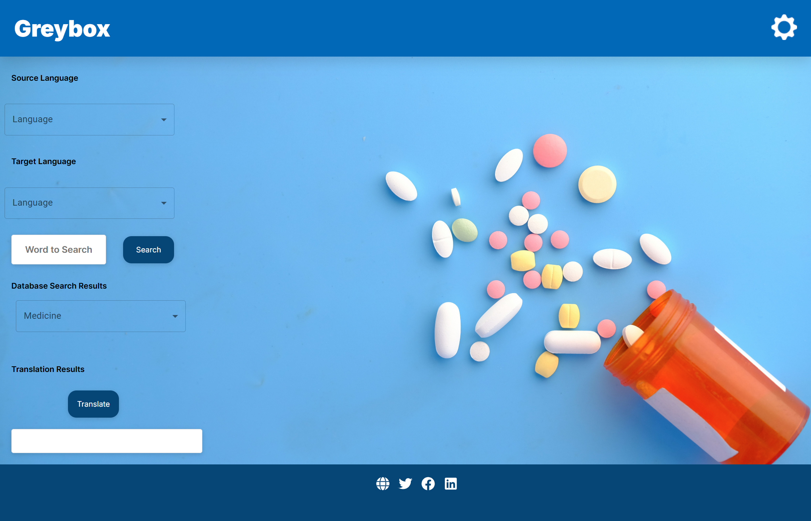
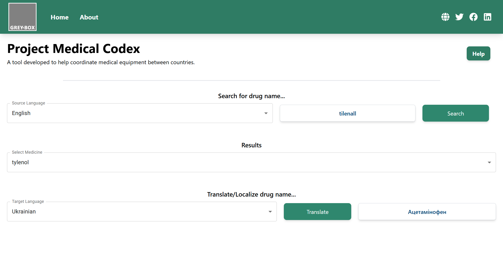

# medical-codex-admin-frontend

[Medical Codex](https://www.grey-box.ca/medical-codex/)

A tool developed to facilitate the search and translation of medical terminology across different languages.

Main Features:

- Search medicinal terms of a known source language, utilizing a fuzzy search algorithm to accommodate any typos or spelling mistakes.
- Select searched medical terms based on search query.
- Translate the selected medical term to a specified language.
  - Supported languages: English, Ukrainian, Russian, French

## UI Overhaul - Before and After

This section showcases the changes made to the user interface as part of our team's contributions.

**Team Blond Maggots:**

- Miles Murphy ([https://github.com/Miles-C-M](https://github.com/Miles-C-M))
- Matthew Quijano ([https://github.com/mq022002](https://github.com/mq022002))
- Thayer Picart ([https://github.com/tmpicart](https://github.com/tmpicart))

<div style="display: grid; grid-template-columns: auto auto; align-items: center; gap: 20px;">
  <div style="text-align: center;">Before:</div>
  <div style="text-align: center;">After:</div>
  <div>
    
  </div>
  <div>
    
  </div>
</div>
<br/>

## System Requirements

- Node: [https://nodejs.org/en](https://nodejs.org/en)
- IDE (Visual Studio Code, JetBrains IDEs, etc.)

## Local Instance Instructions

1. Open your preferred IDE of choice. I am using Visual Studio Code.
2. Open a new terminal and clone the repository using the following command (SSH not considered as that didn't seem required):

```bash
git clone https://github.com/grey-box/medical-codex-admin-frontend.git
```

3. Ensure that you are in the working directory of the repository that you just cloned.
4. Once you are in the root of the cloned repository, you need to install the dependencies:

```bash
npm i
```

5.  Ensure that the backend is running, or if the APIs are deployed, you may only need to adjust your `.env.local`. Please refer to the `.env.template` for help regarding `.env.local` creation. The `.env.local` file should contain environment-specific variables such as API endpoints (e.g., `REACT_APP_API_URL`), authentication keys, or other configuration settings required for the frontend to communicate with the backend. This is also under the assumption that you have the backend endpoints exposed from the backend, or hosted on Azure.
6.  Start the development server:

```bash
npm run dev
```

Assuming everything else is running fine, you should see `localhost:3000` exposed.

---

## Notes

- We have implemented unit testing, end-to-end testing, and linting to ensure the application's code is as stable as possible. The CI workflow that gets kicked off runs a format check, a linter, our unit tests, and end-to-end tests. The linter is a bit sensitive, but it helps ensure code consistency and makes it easier for future developers to understand what changed with each commit with the diff-checker that Git/GitHub provides.
- We integrated a script to help automate the process before developers push. This script will auto-format your code according to 'Prettier' standards and then run a lint to check for any code quality issues. All commands are in `package.json`, but are also listed here for your convenience:

```bash
 `npm run fix-format-and-lint`
```

- You can run Jest unit test suites locally using the following commands in a separate terminal from the Next.js development server:

```bash
npm run test                # run this just to check if they passed
npm run test:coverage       # run this to check if tests pass and how much code you are covering
```

- You can run Cypress end-to-end test suites locally using the following commands in a separate terminal from the Next.js development server. **It is essential to ensure that the development server is running and accessible on port 3000 for these tests to work correctly.**

```bash
npm run cypress:open        # run this to open up the interactive testing suite. This is recommended for debugging any possible issues with tests, as you can inspect elements as if you were in the browser itself.
npm run cypress:headless    # run this to quickly check if tests pass
```

---

## Installation steps for Azure (MacOS based)

```shell
brew update && brew install azure-cli
```

## Login to Azure

```shell
az login --use-device-code
export AZ_SUBSCRIPTION_ID=""
az account set --subscription "${AZ_SUBSCRIPTION_ID}"
```

## Create an App Service Plan

Set the Service Plan variables

```shell
export AZ_APPSERVICE_PLAN="MedicalCodexApp"
export AZ_RESGRP="project_codex_dev"
export AZ_APP_NAME="MedicalCodexFrontend"
```

If you don't have already an App Service Plan, create one

```shell
az appservice plan create \
--name "${AZ_APPSERVICE_PLAN}" \
--resource-group "${AZ_RESGRP}" \
--sku B1 \
--is-linux \
--tags project=codex
```

## Create a web app

```shell
az webapp create --name "${AZ_APP_NAME}" \
--resource-group "${AZ_RESGRP}" \
--plan "${AZ_APPSERVICE_PLAN}" \
--runtime "NODE:20-lts"
```

## Configure Environment Variables

```shell
az webapp config appsettings set --name "${AZ_APP_NAME}" --resource-group "${AZ_RESGRP}" --settings SCM_DO_BUILD_DURING_DEPLOYMENT=1
```

```shell
az webapp config appsettings set --name "${AZ_APP_NAME}" --resource-group "${AZ_RESGRP}" --settings REACT_APP_API_URL="https://medicalcodexbackend.azurewebsites.net"
```

## Deploy Web App

```
az webapp up --name "${AZ_APP_NAME}" \
--resource-group "${AZ_RESGRP}" \
--sku B1 --runtime "NODE:20-lts"
```
